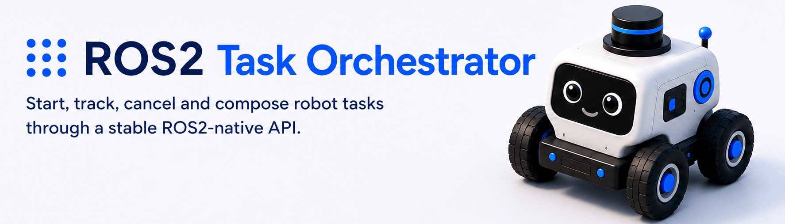

# ROS2 Task Orchestrator

ROS2 Task Orchestrator is an open-source ROS2 package for starting, tracking,
cancelling and composing robot tasks through a stable ROS2-native API.

The project is designed as an edge task layer. Existing ROS2 actions and
services keep implementing robot behavior; the orchestrator provides a common
entry point, task state, results, feedback and events.

## Supported ROS2 Distributions

- Humble
- Jazzy

Humble is the minimum supported distribution.

## Packages

- `task_orchestrator_msgs`: public ROS2 messages, services and actions.
- `task_orchestrator_core`: core orchestrator node and task lifecycle logic.
- `task_orchestrator_examples`: example configs and launch files.

## Build

```bash
source /opt/ros/humble/setup.bash
colcon build --symlink-install
source install/setup.bash
```

## Run

```bash
ros2 launch task_orchestrator_core task_orchestrator.launch.py
```

## Docker

```bash
docker build --build-arg ROS_DISTRO=humble -f docker/Dockerfile -t ros-task-orchestrator:humble .
docker run --rm --network host ros-task-orchestrator:humble \
  ros2 launch task_orchestrator_core task_orchestrator.launch.py
```

For Jazzy:

```bash
docker build --build-arg ROS_DISTRO=jazzy -f docker/Dockerfile -t ros-task-orchestrator:jazzy .
```

## Documentation

- [Architecture](docs/architecture.md)
- [Public API](docs/public_api.md)
- [External Client Integration](docs/external_client_integration.md)
- [ROS2 Support Policy](docs/ros_support.md)
- [Event Envelope](docs/event_envelope.md)

## License

Apache-2.0
